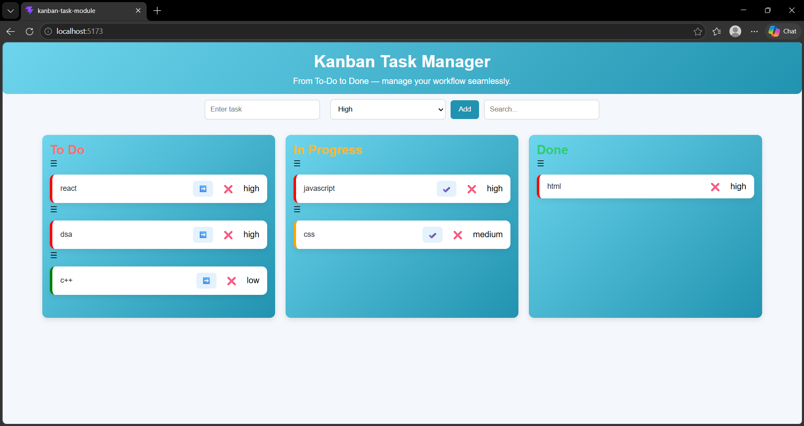

# 🚀 Kanban Task Manager

A modern and interactive Kanban Task Manager built using React. This application helps users manage tasks efficiently with a clean UI and smooth workflow.

---

## ✨ Features

### 🟢 Phase 1 (MVP)

* Add Task
* Delete Task
* Move Task (To Do → In Progress → Done)
* 3-column layout (To Do, In Progress, Done)

### 🟡 Phase 2 (Advanced Features)

* Inline Editing (click to edit task)
* Priority System (High 🔴, Medium 🟡, Low 🟢)
* Data Persistence using localStorage

### 🔵 Phase 3 (Advanced Interaction)

* Drag and Drop (using dnd-kit)
* Search Filter (real-time task filtering)

---

## 🛠️ Tech Stack

* React.js
* JavaScript (ES6)
* CSS3
* dnd-kit (Drag & Drop)
* localStorage (Data Persistence)

---

## 📦 Installation

```bash
npm install
npm start
```

---

## 🌐 Live Demo

👉 [Your Vercel Link Here]

---

## screenshot
## 📸 Screenshot



---

## 📂 Project Structure

* App.jsx → Main logic
* components/

  * ToDo.jsx
  * Progress.jsx
  * Done.jsx
  * TaskCard.jsx
  * DraggableTask.jsx
  * DroppableColumn.jsx

---

## 🚀 Deployment

Deployed using Vercel.

---

## 🙋‍♀️ Author

Deepa Bhatt
Frontend Developer
